---
output:
  xaringan::moon_reader:
    includes:
      after_body: insert-logo.html
    self_contained: false
    lib_dir: libs
    nature:
      highlightStyle: github
      highlightLines: true
      countIncrementalSlides: false
editor_options: 
  chunk_output_type: console
---
class: center, inverse

```{css echo=FALSE}
.pull-left {
  float: left;
  width: 44%;
}
.pull-right {
  float: right;
  width: 44%;
}
.pull-right ~ p {
  clear: both;
}
```


# Breaking the HISCO Barrier: AI and Occupational Data Standardization
## Christian Møller-Dahl
## Christian Vedel
### University of Southern Denmark, HEDG

#### Twitter: @ChristianVedel,
#### Email: christian-vs@sam.sdu.dk
#### Updated `r Sys.Date()` 

---

# Introduction
.pull-left[
### Motivation
- Manual labelling of data is tedious, expensive and error-prone  
- We collectively poor thousands of hours into similar work
- 4 mil. $\rightarrow$ 96k $\rightarrow$ 605 days of work 


### This presentation
- **Automatic tool to make HISCO labels** 
- Early work in progress 
- 98 percent precision
- How it is done 
]

.pull-right[
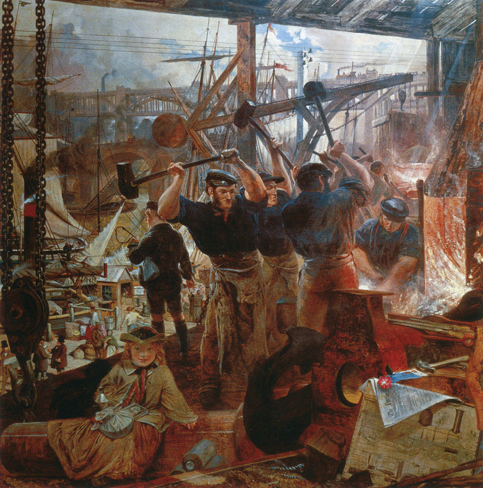
*Willam Bell Scott (1861) "Iron and Coal" (Wikimedia)*

]

---
# HISCO codes
- Derived from ISCO (International Standard Classification of Occupations) 
- Invented for the sake of international comparability  
- Introduced by Leuwen, Maas, Miles (2002) based on ISCO68  
- Hiearchical structure well suited for analysis
- Common application: Convert to ranking (HISCAM, HISCLASS, etc. )
- Usually labelled with 'smart' manual methods 


---
.pull-left[
## The naive solution
- List all unique occupational descriptions and label them e.g. "farm servant: 62120"
- Label via lookup table  

## The challenge
- 17865 different occupational descriptions fit with "farm servant" in DK censuses ("in service", "servant girl", "servant boy", "servant woman", "servant karl")
- HISCO has ~2000 occupational classes, each with similar complexity in writing 
- Spelling mistakes, **negations**, and different spelling conventions

]

--
.pull-right[
## The solution

- Use machine learning! 
- Multi-label multiple classification 
- Trivial machine learning problem 
- Apply tricks from the machine learning literature to improve performance on unseen examples
]

---

.pull-left[
## The tricks

- Unseen test and validation data 
- LSTM reccurent: Reads with memory "lives of fishing and farm work" (Hochreiter, Schmidhuber, 1997)
- Overparameterized neural network: More parameters than data (Allen-Zhu, Li, Liang, 2018) 
- Regularization via dropout: Some neurons are randomly disabled in training (Srivastava et al 2014) 
- Embedding: Represent language in high-dimensional space  (Mandelbaum, 2016)
- Data augmentation (Moris et al, 2020): 
  + "farmer": {"farmtr", "fermer", "yellow farmer"}
]


.pull-right[
**Overfitting**

(Wikimedia)

### Metrics
- Accuracy
- Precision
- Recall 
- F1 
- Micro- and macro-level 
- In training: Binary cross-entropy (differentiable)
]

---
# Data sources 
.pull-left[
### Training data

- Danish Census data (1787-1901) 
  + Has manual HISCO labels for 1787, 1801, 1845, 1880 
  + 3.7 mio labels 
- UK marriage certificates (1837-1939)
  + Labelled Clark, Cummins, Curtis (2022)
  + 4.2 mio labelled observations 
  
- *Adequate performance down to 10.000 labels*
]

.pull-right[
### Other data
- Swedish census data
- Norwegian census data
- Dutch family history data 
- Labelled biographies
- IPUMS
- Barcelona Historical Marriage Database

### Call for data!
- If you have something with HISCO labels on it, please send it to christian-vs@sam.sdu.dk. I owe you HISCO codes 

]


---
# The architecture


### Training 
- Model starts at random state
- Continuously tweaked towards more correct predictions

### Ongoing work
- Replacing the brains by a transformer model (BERT) *akin to a chatGPT-frankenstein*

---
# Training
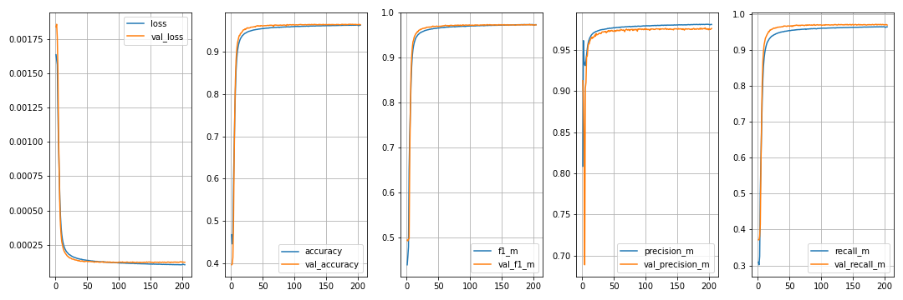

### Stopping condition 
- When validation loss has not improved for 10 epochs training stops

---
# The product
```{r echo=TRUE, message=TRUE, warning=TRUE, eval=FALSE}
# Example prompts
string_to_hisco("A farmer")
string_to_hisco("Tailor of beautiful dresses")
string_to_hisco("The train's fireman")
```

--

```{r echo=FALSE, message=TRUE, warning=TRUE}
# Example prompts
rbind(
  data.frame(
    string = "A farmer",
    hisco = "61110",
    description = "General Farmer"
  ),
  data.frame(
    string = "Tailor of beautiful dresses",
    hisco = "79100",
    description = "Tailor, Specialisation Unknown"
  ),
  data.frame(
    string = "The train's fireman",
    hisco = "98330",
    description = "Railway SteamEngine Fireman"
  )
)

```


---
# The performance (1/x)

*DK data based on 300.000 validation observations*

### Macro level performance

```{r echo=FALSE}
load("DK_stats.Rdata")
x = all_stats[2,]
rownames(x) = NULL
knitr::kable(x) 
```


--

### Micro level

```{r echo=FALSE}
load("DK_stats.Rdata")
x = all_stats[1,]
rownames(x) = NULL
knitr::kable(x) 
```


---
# The performance (2/7)
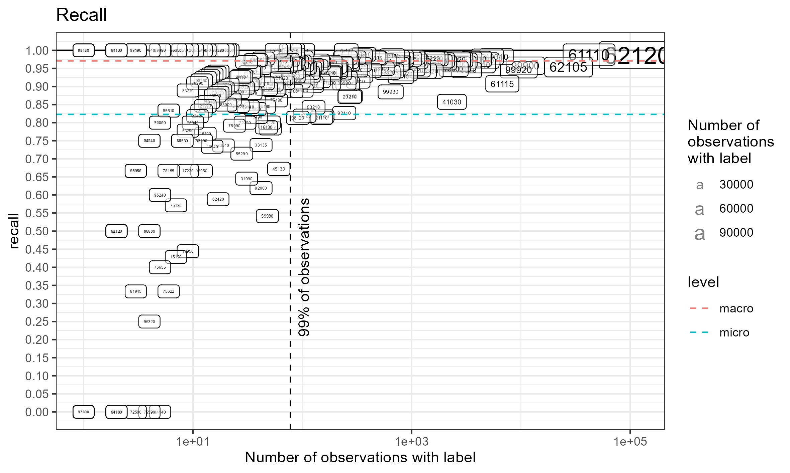

---
# The performance (2/7)
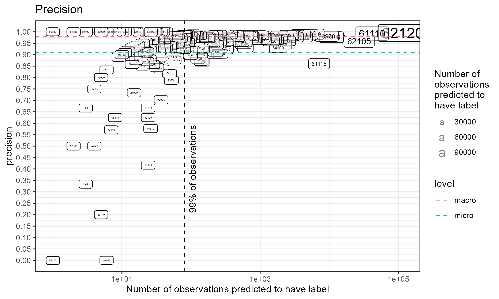
---
# The performance (2/7)
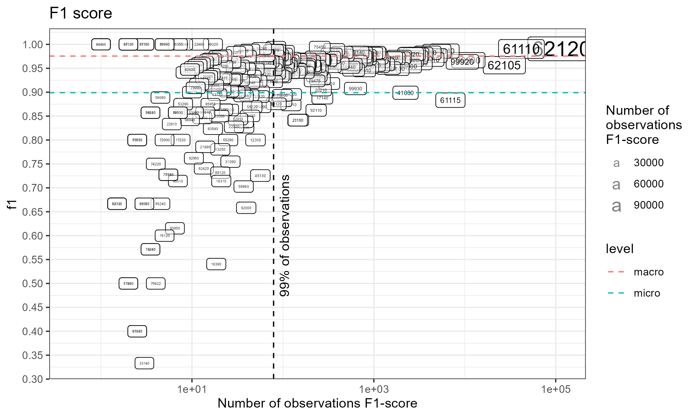

---
# The performance (3/7): Confusion matrix

---
# The performance (3/7): Confusion matrix
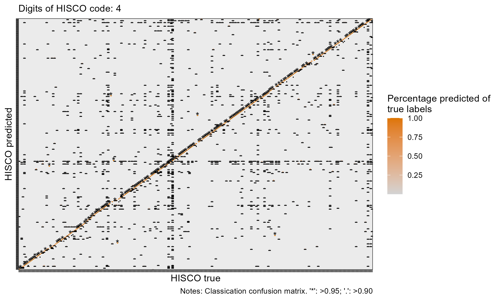
---
# The performance (3/7): Confusion matrix
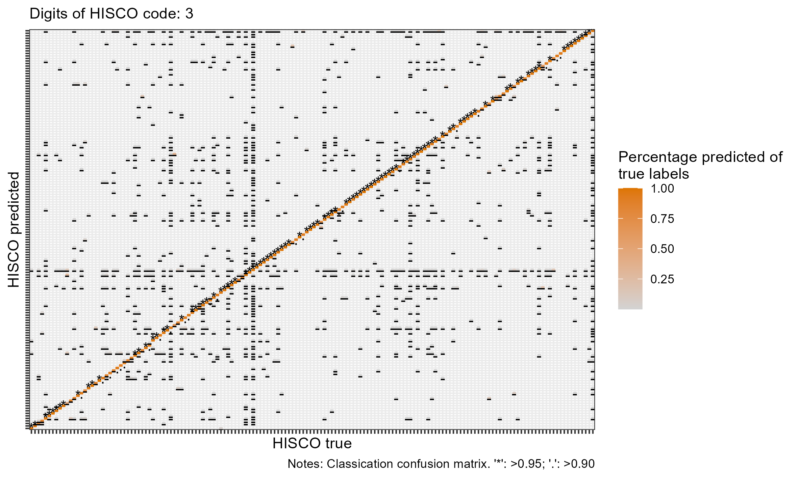

---
# The performance (3/7): Confusion matrix
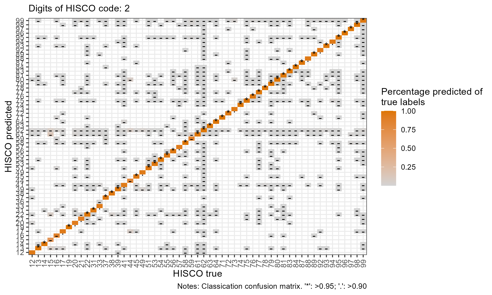
---
# The performance (3/7): Confusion matrix


---
# The performance (4/7)

### Results for fewer samples

```{r echo=FALSE}
load("All_evals.Rdata")
rownames(eval) = NULL

DT::datatable(
  eval,
  fillContainer = FALSE, options = list(pageLength = 8)
)
```


---
# The performance (5/6)

### Results for fewer samples

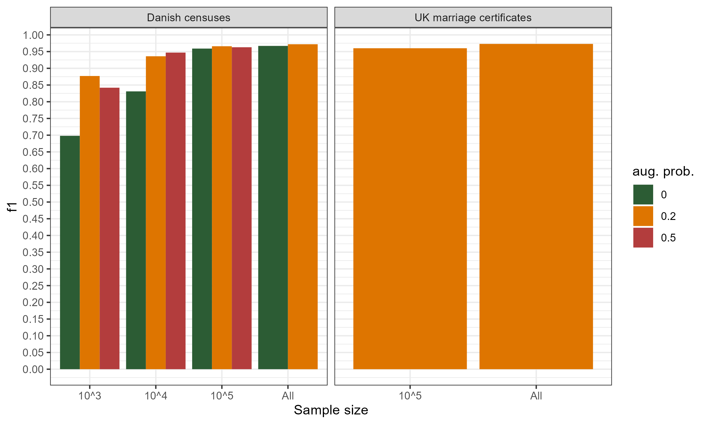

---
# The performance (6/7)
### What about SES scores?
```{r echo=FALSE}
load("SES_scores.Rdata")
rownames(eval) = NULL

DT::datatable(
  SES_perf,
  fillContainer = FALSE, options = list(pageLength = 8)
)
```

---
# Performance (7/7) 
**Some preliminary results** 
- Even better performance for UK data 
- 90% accuracy on Copenhagen burial records (100 random samples)
- ~90% accuracy in Norwegian census data
- 80% accuracy on Faroe Island data 

---


#### An applcation

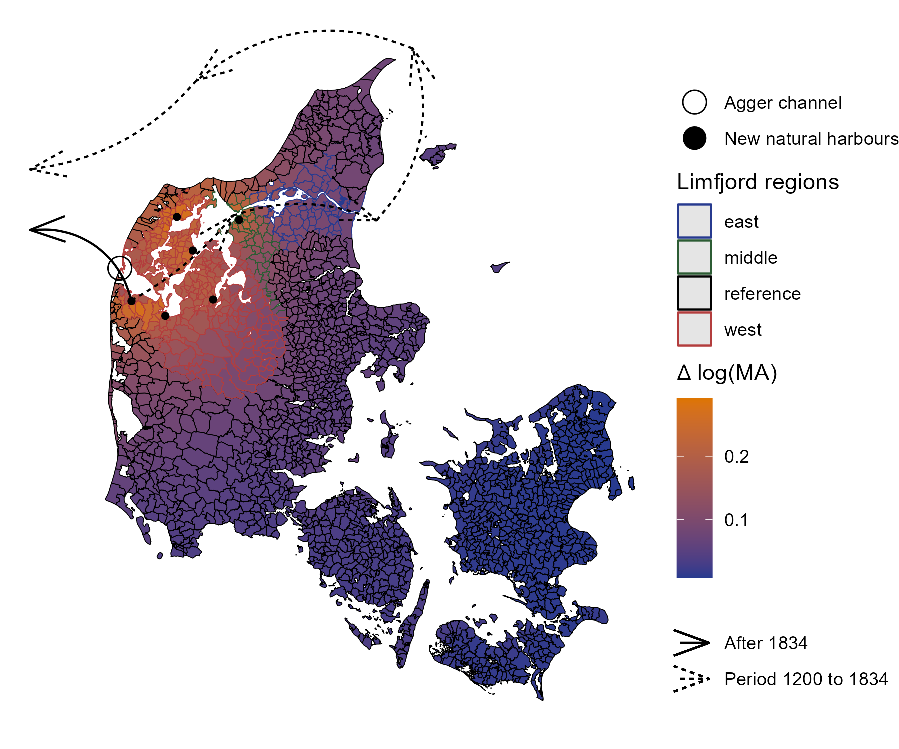

---
# Empirical strategy

$$log(y_{it}) = Affected_i \times Year_t \beta_t + FE + \varepsilon_{it}$$


---
### Breach $\rightarrow$ Parishes with fishermen
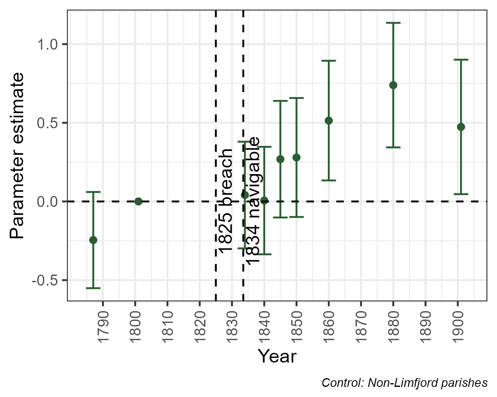

---
# Conclusion

### Steps ahead
- Transferlearning: Give it 1000 samples to fine tune it yo your need 
- Application oriented validation: 
  + Can we replicate econometrics results with same outcomes in human/computer labels 
  + What is the human error rate? 

### Please let me know
- How do we make automatic HISCO-labeling a broadly available tool for the profession? Is it something you can see yourself using? 
- <p style="color:red;">If you have data to HISCO codes, please send it to me (christian-vs@sam.sdu.dk)</p>
- <p style="color:red;">In return I owe you HISCO codes for your project!</p>


