---
output:
  xaringan::moon_reader:
    includes:
      after_body: insert-logo.html
    self_contained: false
    lib_dir: libs
    nature:
      highlightStyle: github
      highlightLines: true
      countIncrementalSlides: false
      ratio: '16:9'
editor_options: 
  chunk_output_type: console
---
class: center, inverse, middle

```{r xaringan-panelset, echo=FALSE}
xaringanExtra::use_panelset()
```

```{r xaringan-tile-view, echo=FALSE}
xaringanExtra::use_tile_view()
```

```{r xaringanExtra, echo = FALSE}
xaringanExtra::use_progress_bar(color = "#808080", location = "top")
```

```{css echo=FALSE}
.pull-left {
  float: left;
  width: 48%;
}
.pull-right {
  float: right;
  width: 48%;
}
.pull-right ~ p {
  clear: both;
}

.pull-left-wide {
  float: left;
  width: 66%;
}
.pull-right-wide {
  float: right;
  width: 66%;
}
.pull-right-wide ~ p {
  clear: both;
}

.pull-left-narrow {
  float: left;
  width: 30%;
}
.pull-right-narrow {
  float: right;
  width: 30%;
}

.tiny123 {
  font-size: 0.40em;
}

.small123 {
  font-size: 0.80em;
}

.large123 {
  font-size: 2em;
}

.huge123 {
  font-size: 4em;
}

.red {
  color: red;
}

.highlight {
  background-color: yellow;
}
```


.huge123[
# Breaking the HISCO Barrier: 
## *Automatic Occupational Standardization with OccCANINE*
]

#### Christian Møller Dahl, Torben Johansen, Christian Vedel
#### University of Southern Denmark, HEDG

**Email: christian-vs@sam.sdu.dk**  
**arXiv: [arxiv.org/abs/2402.13604](https://arxiv.org/abs/2402.13604)**  
**Updated `r Sys.Date()`**


---
# Data examples
```{r echo = FALSE, message=FALSE, warning=FALSE}
library(tidyverse)
```


```{r echo=FALSE}
# load("Data_example_presentation.Rdata")
# Danish:
# tmp = readxl::read_excel("CopenhagenBurials_05_manual_check.xlsx", skip = 1)
suppressWarnings({
  tmp = read_csv("../../histocc/Data/TOYDATA.csv", col_types = "c")
})
rownames(tmp) = NULL

set.seed(20)
tmp = tmp %>%
  distinct() %>% 
  select(occ1) %>%
  filter(nchar(occ1) > 25) %>% 
  rename(`Raw entry` = occ1)

DT::datatable(
  tmp,
  fillContainer = FALSE, options = list(pageLength = 5)
)


```

.small123[
*Example data from Clark, Cummins Curtis (2022)*
]

---
<br>
<br>
<br>
<br>
.pull-left-wide[
# This presentation
- We solve the problem from the previous slide
- Introduce OccCANINE
- New results which does not appear in current working paper
  + Based on more training data
  + Updated architecture + 'oil' (order-invariant-loss)
- .red[*No new insights*]
]

--

.pull-left-wide[
### Who is this for?
.small123[
- Labor/economic history crowd: Here is a new tool
- ML/NLP crowd: A new application
- Everyone else: Here is a pipeline for dealing with messy text data
]
]


---
# HISCO codes
- Derived from ISCO (International Standard Classification of Occupations) 
- Invented for the sake of international comparability  
- Introduced by Leuwen, Maas, Miles (2002) based on ISCO68  
- Hiearchical structure well suited for analysis

```{r echo=FALSE, message=FALSE, warning=FALSE, out.height="300px", out.width="709px"}
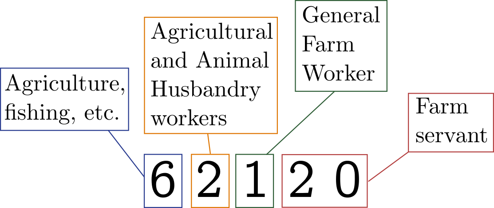
```


---
class: middle
# Our solution
.pull-left[
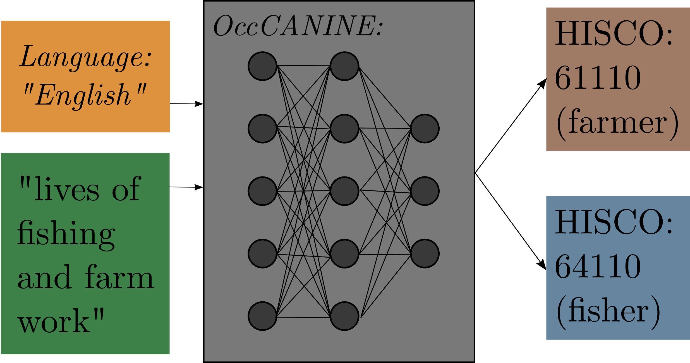
.center[
### OccCANINE
]
]

.pull-right[
.middle[

- We train a Neural Network for 27 days on all of the data
- Augment input during training

.red[
~10k HISCO codes in 27 seconds  
~100k HISCO codes in 5 min.  
~1 million HISCO codes in 45 min.  
$\rightarrow$ **All with high precision and recall**

]
]
]

.footnote[
Canine: Pre-training an Efficient Tokenization-Free Encoder for Language Representation (Clark et al., TACL 2022)
]

???
- *Small* language model
- Transformer architecture: CANINE
- Character level: fairly robust to typos, spelling mistakes, and changing spelling conventions
- Finetuned to predict HISCO codes
- **Really fast**


--
.pull-right-narrow[
.red[**Please send us some data. We owe you HISCO codes in return**]


.red[christian-vs@sam.sdu.dk]
]

---
class: middle
# State of the art

.pull-left-wide[
- **Rule-based & dictionary methods**: Hand-crafted lookup tables, regular expressions, and intensive cleaning deliver decent accuracy but are laborious, brittle, and hard to port to new data (Patel, 2012; Gweon 2017).
- **Classical ML pipelines**: Bag-of-words, k-NN, boosting trees, random forests on survey-specific features raise automation but still depend on heavy pre-processing and are typically tuned to one country/system/time period (Schierholz, 2020; Turrell, 2022, van der Heijden 2022).
- **Overall**: Most existing solutions are **one-off**—built for a single survey or classification and must be rebuilt for each new context. **OccCANINE is designed as a broad, shared backbone**: multilingual, historical, and easily adapted to multiple occupational coding systems.
]


---
# Architecture
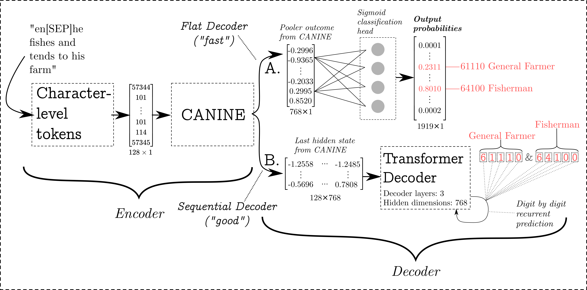

---
## Thanks to data contributors
.pull-left-wide[
.tiny123[
| file                        | Observations | Percent | Language | Source                                                    |
|-----------------------------|--------------|---------|----------|-----------------------------------------------------------|
| DK_census_[x].csv           | 5,391,656    | 29.794% | da       | Clausen (2015); The Danish National Archives              |
| EN_marr_cert_[x].csv        | 4,046,203    | 22.359% | en       | Clark, Cummins, Curtis (2022)                             |
| EN_uk_ipums_[x].csv         | 3,026,859    | 16.726% | en       | MPC (2020); Office of National Statistics                 |
| SE_swedpop_[x].csv          | 1,793,557    | 9.911%  | se       | SwedPop (2022)                                            |
| JIW_database_[x].csv        | 966,793      | 5.343%  | nl       | De Moor & van Weeren (2021)                               |
| EN_ca_ipums_[x].csv         | 818,657      | 4.524%  | unk      | MPC (2020); Statistics Canada                             |
| CA_bcn_[x].csv              | 644,484      | 3.561%  | ca       | Pujades-Mora & Valls (2017)                               |
| HISCO_website_[x].csv       | 392,248      | 2.168%  | mult     | HISCO website                                             |
| HSN_database_[x].csv        | 184,937      | 1.022%  | nl       | Mandemakers et al (2020)                                  |
| NO_ipums_[x].csv            | 147,255      | 0.814%  | no       | MPC (2020)                                                |
| FR_desc_[x].csv             | 142,778      | 0.789%  | fr       | historyofwork.iisg.nl                                     |
| EN_us_ipums_[x].csv         | 139,595      | 0.771%  | en       | MPC (2020); Bureau of the Census                          |
| EN_ship_data_[x].csv        | 103,023      | 0.569%  | en       | Schneider & Gao (2019)                                    |
| EN_parish_[x].csv           | 73,806       | 0.408%  | en       | de Pleijt, Nuvolari, Weisdorf (2020)                      |
| DK_cedar_[x].csv            | 46,563       | 0.257%  | da       | Ford (2023)                                               |
| SE_cedar_[x].csv            | 45,581       | 0.252%  | se       | Ford (2023)                                               |
| DK_orsted_[x].csv           | 36,608       | 0.202%  | da       | Ford (2023)                                               |
| EN_oclack_[x].csv           | 24,530       | 0.136%  | en       | O-clack                                                   |
| EN_loc_[x].csv              | 23,179       | 0.128%  | en       | Mooney (2016)                                             |
| IS_ipums_[x].csv            | 20,459       | 0.113%  | is       | MPC (2020)                                                |
| SE_chalmers_[x].csv         | 14,426       | 0.08%   | se       | Ford (2023)                                               |
| DE_ipums_[x].csv            | 8,482        | 0.047%  | de       | MPC (2020); Statistics Netherlands                        |
| IT_fm_[x].csv               | 4,525        | 0.025%  | it       | Fornasin & Marzona (2016)                                 |

]
]

.pull-right-narrow[
- A lot of researchers have solved the task of turning strings into HISCO codes
- We simply make their work generalizable

- I couldn't fit everyone, and people still send us data
- Please send us your data at christian-vs@sam.sdu.dk 
]


---
# How to train a generalizable solution?
.pull-left[
### Two principal solutions:
1. Learn every title character by character
2. Learn the concept of a specific occupation (like a human)

.red[
- We try to push it towards the second type of solution
]

]

.pull-right[
### How?
.small123[
- Random string augmentations:
  + "he is a farmer" $\rightarrow$ "ht s a frmer"
  
- Dropout:
  + We disable 10% of neural pathways randomly during training
  
- We make synthetic combinations
  + "he is a fisher" + "carpenter" $\rightarrow$ "he is a fisher **and** carpenter"
  
- It does not know the language in 25% of cases

- **New:** We generate adverse examples: Change strings until the model marginally fails *+ gibberish + translated strings*
  
- Training data, validation data, test data and out-of-distribution data
]
]


---
# Training - technical details
.pull-left[
- We use Adam optimizer
- Two loss functions:
  + Binary Cross-entropy loss for 'fast' decoder
  + Order-invariant loss (oil) for 'good' decoder
- All runs efficiently with *teacher forcing*. I.e. we predict all digits in one go, excluding 'illegal' information. 
]

---
# OIL: Order-Invariant loss (intuition)

.pull-left[
- Many entries contain **multiple occupations**:
  - *"policeman and farmer"*
  - *"he fishes and farms"*
- These map to several valid HISCO codes:
  - e.g. $61110$ (Farmer), $64100$ (Fisherman)

- For the model, the **set** of codes is what matters  
  $\Rightarrow$ $\{61110, 64100\}$ is correct in **any order**

.red[
Standard sequence loss is order-sensitive  
$\Rightarrow$ wrong penalty for correct but permuted outputs
]

- Note: This is trivial in the 'fast' decoder: Cross Entropy

]


--

.pull-right[
```text
"he fishes and farms"

Target codes:
  [Farmer, Fisher]

Predicted (model):
  [Fisher, Farmer]

Standard loss:
  ❌ (wrong order)

Order-invariant loss:
  ✅ (same set)
```

#### We solve this while maintaining useful properties
- We can take the derivative
- Teacher forcing compatible
- Efficient to compute

] 


---

# Order-invariant loss (details)

.small123[

- Split prediction into $N$ candidate code blocks, each of length $b$.

- For each candidate $i$ and target $j$, compute block loss

$$L_{ij} = \frac{1}{b} \sum_{\ell = 0}^{b - 1} \mathrm{CE}\big(\hat{Y}_i[\ell], Y_j[\ell]\big).$$

- Let $k$ be the number of valid target codes.  
  **Order-invariant matching across blocks:**
  
$$L_{\mathrm{inv}}
= \frac{1}{k} \sum_{j = 0}^{k - 1}
\min_{0 \le i < k} L_{ij}.$$

  Each true code is matched to its best-predicted block.

- We need to promote sparcity. Let $\mathcal{M}_i$ be a mask indicating if block $i$ should *not* contain a valid code.
  
$$L_{\mathrm{pad}}
= \frac{1}{N} \sum_{i = 0}^{N - 1} \mathcal{M}_i L_{\mathrm{pad}}^i.$$

  Where $L_{\mathrm{pad}}^i$ is 0 if block $i$ predicts the 'padding' code, and CE to padding otherwise.

- Final objective for the 'good' decoder:
$$L = L_{\mathrm{inv}} + \lambda L_{\mathrm{pad}},$$
  with $\lambda$ tuning how hard we penalize spurious codes.

]

---
# Training in practice
.pull-left-narrow[
- 30 days of training
- Batch size: 512
- Model exposed to full training data 50 times

- **Note:** *Sequential Decoder* trains much faster than *Flat Decoder* - because of the fewer dimensions of output space
]

.pull-right-wide[
.pull-right-wide[
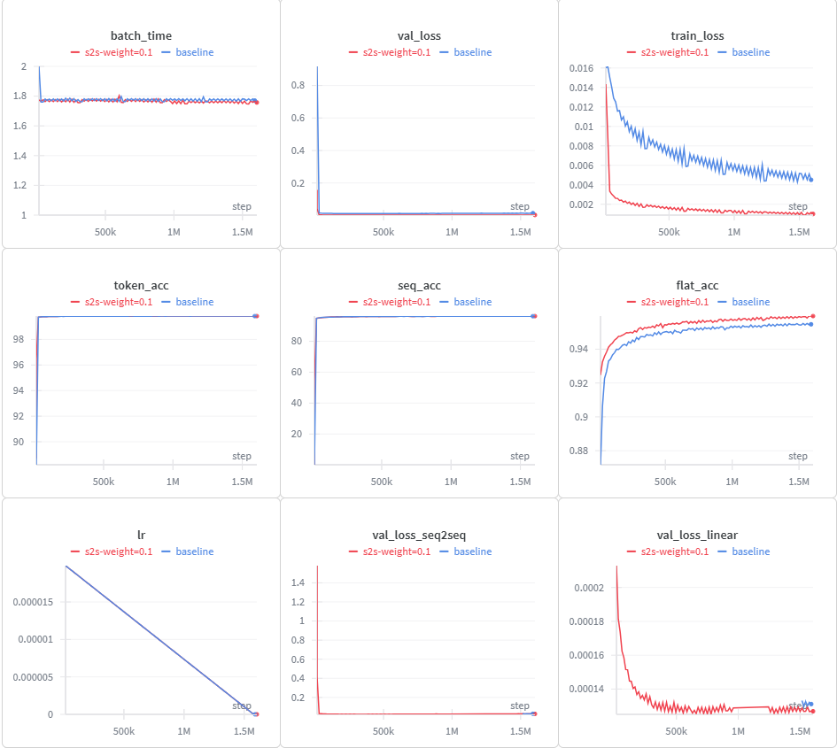
]
]


---

# The product
```{r echo=TRUE, message=TRUE, warning=TRUE, eval=FALSE}
# Example prompts
model.predict("A farmer")
model.predict("Tailor of beautiful dresses")
model.predict("The train's fireman")
```

--
```{r echo=FALSE, message=TRUE, warning=TRUE}
# Example prompts
rbind(
  data.frame(
    string = "A farmer",
    hisco = "61110",
    description = "General Farmer"
  ),
  data.frame(
    string = "Tailor of beautiful dresses",
    hisco = "79100",
    description = "Tailor, Specialisation Unknown"
  ),
  data.frame(
    string = "The train's fireman",
    hisco = "98330",
    description = "Railway SteamEngine Fireman"
  )
)

```

.footnote[
***See '[PREDICT_HISCOs.py](https://github.com/christianvedels/OccCANINE/blob/main/PREDICT_HISCOs.py)' or [colab](https://github.com/christianvedels/OccCANINE/blob/main/OccCANINE_colab.ipynb)***
]


---
# Test data performance (1/2)
| Decoder | Statistic | **Digits** |   |   |   |   |
|---------|-----------|-----------|---|---|---|---|
|         |           | 1 | 2 | 3 | 4 | 5 |
| *good*  | accuracy  | 0.977 | 0.968 | 0.964 | 0.961 | 0.960 |
|         | precision | 0.978 | 0.968 | 0.964 | 0.961 | 0.960 |
|         | recall    | 0.982 | 0.974 | 0.971 | 0.967 | 0.967 |
|         | f1        | 0.979 | 0.970 | 0.966 | 0.963 | 0.963 |
| *fast*  | accuracy  | 0.979 | 0.971 | 0.967 | 0.964 | 0.964 |
|         | precision | 0.980 | 0.972 | 0.968 | 0.965 | 0.965 |
|         | recall    | 0.983 | 0.979 | 0.976 | 0.973 | 0.973 |
|         | f1        | 0.981 | 0.974 | 0.971 | 0.968 | 0.967 |


.footnote[
.small123[
*Based on 1M test observations*
]
]

---
# Test data performance (2/2) 
```{r echo=FALSE, message=FALSE, warning=FALSE, out.height="450px", out.width="675px"}
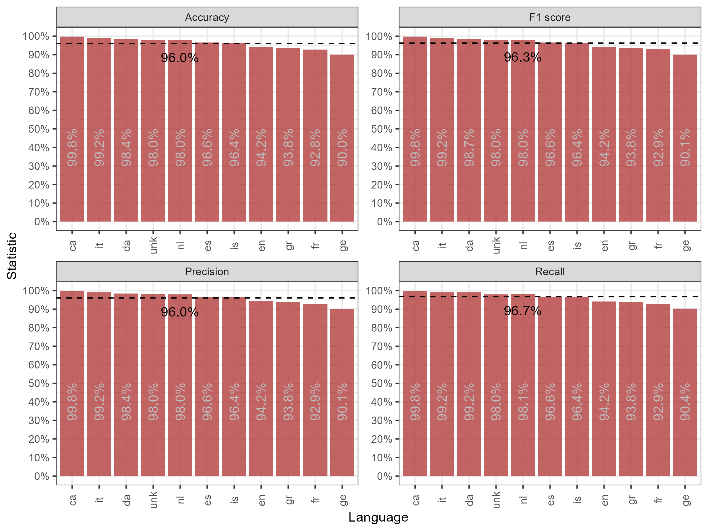
```


---
# The nature of the mistakes
.panelset[
.panel[.panel-name[Example 1]
.center[
```{r echo=FALSE, message=FALSE, warning=FALSE, out.height="450px", out.width="675px"}
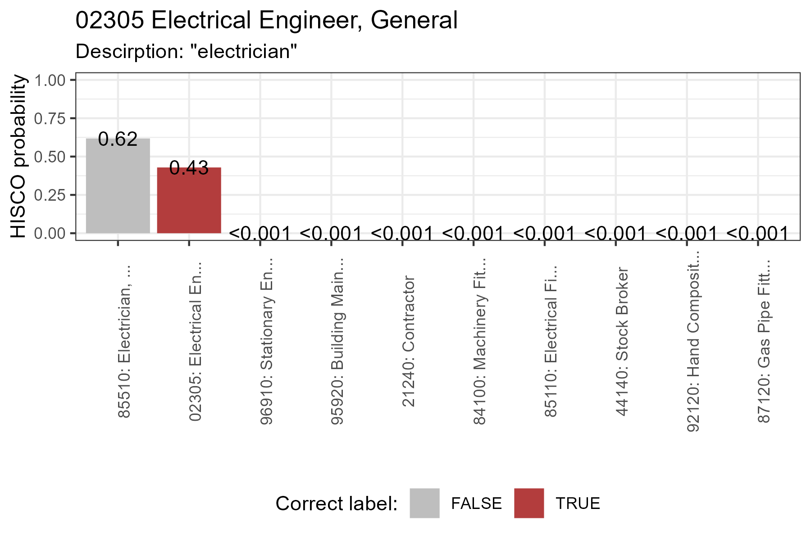
```
]
]
.panel[.panel-name[Example 2]
.center[
```{r echo=FALSE, message=FALSE, warning=FALSE, out.height="450px", out.width="675px"}
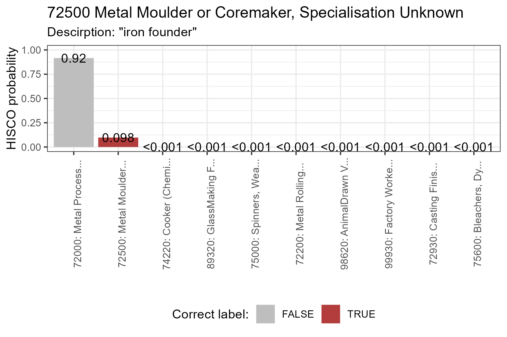
```
]
]
.panel[.panel-name[Example 3]
.center[
```{r echo=FALSE, message=FALSE, warning=FALSE, out.height="450px", out.width="675px"}
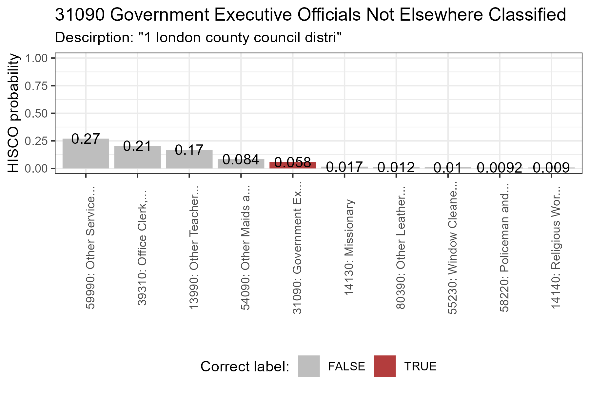
```
]
]
.panel[.panel-name[Example 4]
.center[
```{r echo=FALSE, message=FALSE, warning=FALSE, out.height="450px", out.width="675px"}
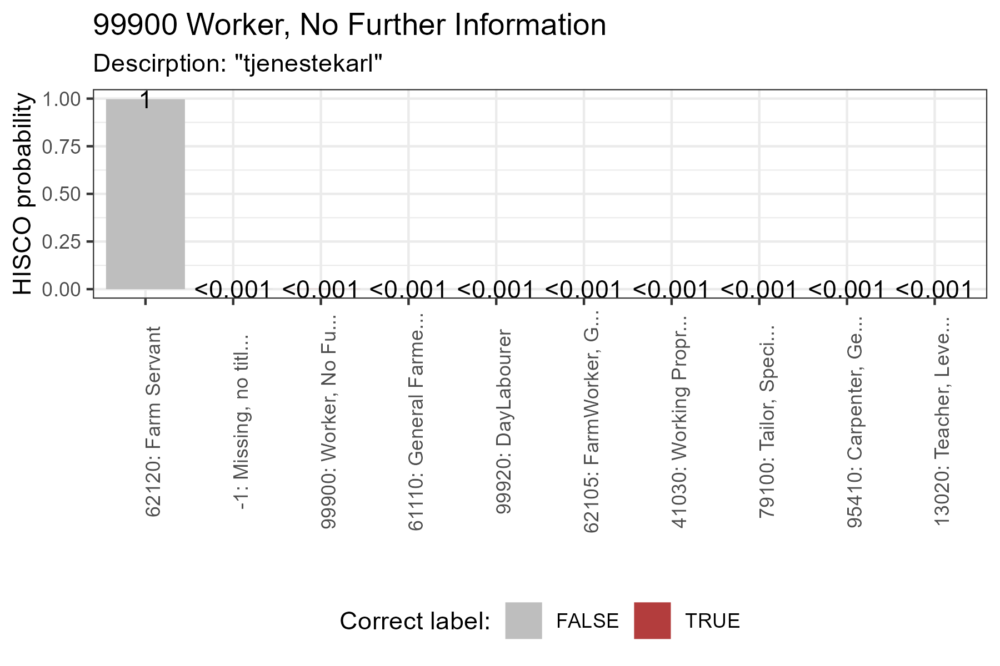
```
]
]
]

---
# Differential error rates
.pull-left-narrow[
- Performs best for the most common HISCO codes (99% --> 524 HISCO codes)
- (As does squishy wet neural networks)
]

.pull-right-wide[
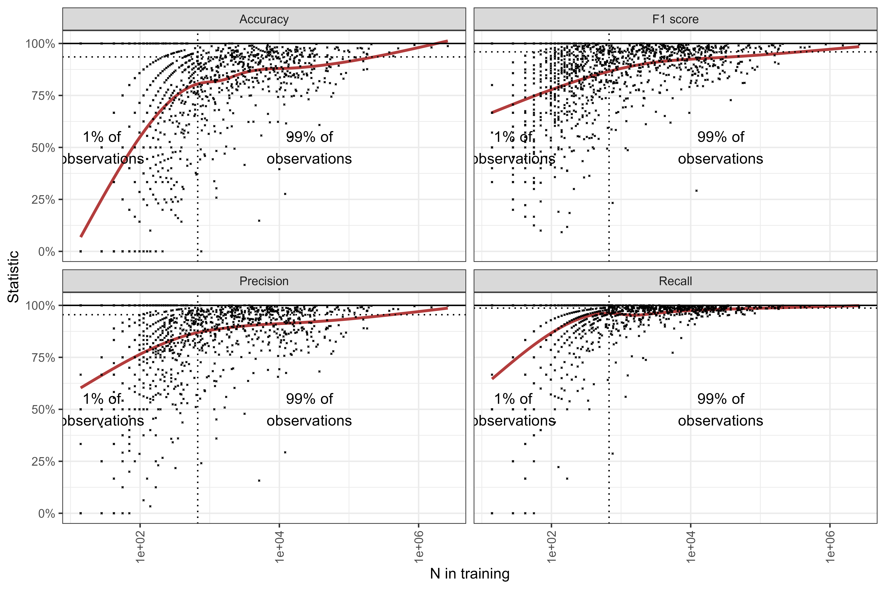
]

---
name: bias
# Bias

.pull-left-narrow[
- Potential problem: If error rates are correlated with Socio-Economic Status
- Turns out its not
- [Not in a regression setting either](#bias-reg)
]

.pull-right-wide[
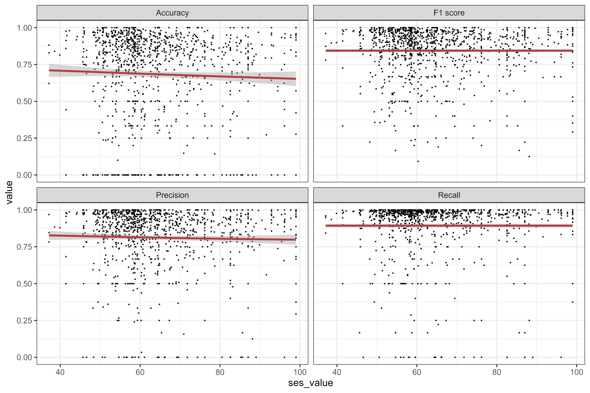
]


---
# Out of distribution

 
| Dataset                       |   n |   substantial |   strict |
|-------------------------------|----:|--------------:|---------:|
| Copenhagen Burial Records     | 367 |         0.962 |    0.890 |
| Norwegian Student Biographies | 500 |         0.950 |    0.874 |


.footnote[
.small123[
$^*$ *Thanks to Bram Hilkens*  
See more details in the paper
]
]

---
# More OOD testing

| Dataset                       | Observations |     1 |     2 |     3 |     4 |     5 |
|-------------------------------|-------------:|------:|------:|------:|------:|------:|
| **Panel A: Raw data**         |              |       |       |       |       |       |
| Swedish Strikes               |        1,430 | 0.957 | 0.946 | 0.927 | 0.897 | 0.896 |
| Dutch Wealth Tax              |          200 | 0.938 | 0.892 | 0.780 | 0.767 | 0.760 |
| Italian Marriage Certificates |       26,287 | 0.877 | 0.866 | 0.854 | 0.835 | 0.828 |
| German Denazification Survey  |          800 | 0.785 | 0.731 | 0.665 | 0.647 | 0.638 |
| Danish West Indies            |      166,563 | 0.704 | 0.684 | 0.680 | 0.651 | 0.645 |
| UK Bankruptcies               |      581,912 | 0.754 | 0.676 | 0.656 | 0.641 | 0.638 |
| **Panel B: Removed HISCO code ‘-1’: No occupation** | | | | | | |
| Danish West Indies            |      101,619 | 0.828 | 0.795 | 0.788 | 0.741 | 0.732 |
| UK Bankruptcies               |      326,400 | 0.922 | 0.783 | 0.747 | 0.721 | 0.720 |

---
```{r include=FALSE, message=FALSE, warning=FALSE}
library(tidyverse)
library(plotly)

loadR1 = function(x){
  load(x)
  return(p3d)
}
loadR2 = function(x){
  load(x)
  return(p2d)
}

p3d_wlang_base = loadR1("Figures/CANINE baseline (w. lang)Interactive_tsne_3d.Rdata")
p3d_wlang = loadR1("Figures/CANINE finetuned (w. lang)Interactive_tsne_3d.Rdata")
p3d_wolang_base = loadR1("Figures/CANINE baseline (wo. lang)Interactive_tsne_3d.Rdata")
p3d_wolang = loadR1("Figures/CANINE finetuned (wo. lang)Interactive_tsne_3d.Rdata")

p2d_wlang_base = loadR2("Figures/CANINE baseline (w. lang)Interactive_tsne_2d.Rdata")
p2d_wlang = loadR2("Figures/CANINE finetuned (w. lang)Interactive_tsne_2d.Rdata")
p2d_wolang_base = loadR2("Figures/CANINE baseline (wo. lang)Interactive_tsne_2d.Rdata")
p2d_wolang = loadR2("Figures/CANINE finetuned (wo. lang)Interactive_tsne_2d.Rdata")
```

# The advantage of OccCANINE as a language model
.pull-left-narrow[
- The model learns to understand occupational structures *semantically*
- *This is evident from the the embeddings: 768 dimensions reduced to 2*
- Natural starting point for other general tasks related to occupation
 $\rightarrow$
]

.pull-right-wide[
.panelset[
.panel[.panel-name[CANINE]
.center[
```{r echo=FALSE, message=FALSE, warning=FALSE, fig.width=7, fig.height=5, fig.align='center'}
p2d_wlang_base %>% layout(autosize = F, width = 500, height = 400)
```
]
]
.panel[.panel-name[OccCANINE]
```{r echo=FALSE, message=FALSE, warning=FALSE, fig.width=7, fig.height=5}
p2d_wlang %>% layout(autosize = F, width = 500, height = 400)
```
]
]
]

---
class: middle

# Demonstration

.pull-left-narrow[
- Everything is open source.
- You can use our method with basic Python-skills
- Most functionalities demonstrated here: [colab](https://github.com/christianvedels/OccCANINE/blob/main/OccCANINE_colab.ipynb)
]


.pull-right-wide[
<iframe width="560" height="315" src="https://www.youtube.com/embed/d8dR5-clJeQ?si=R6mPJ0Yn2KGXKy-B" title="YouTube video player" frameborder="0" allow="accelerometer; autoplay; clipboard-write; encrypted-media; gyroscope; picture-in-picture; web-share" referrerpolicy="strict-origin-when-cross-origin" allowfullscreen></iframe>
]

---
# Other systems: What about ...
.pull-left-narrow[
... OCC1950 (US censuses)  
... OCCICEM (UK censuses)  
... ISCO-68  
... and so on?

**Our solution also applies to those cases with finetuning**
]

--

.pull-right-wide[
#### Panel A: Full training data
*~20 days of finetuning - millions of observations*

| Target system | Accuracy | F1-score |
|---------------|----------|----------|
| ISCO-68       |    0.938 |    0.958 |
| OCCICEM       |    0.974 |    0.977 |
| OCC1950       |    0.866 |    0.875 |

#### Panel B: Small scale training
*~20 .red123[hours] of finetuning - 10.000 observations*

| Target system | Accuracy | F1-score |
|---------------|----------|----------|
| ISCO-68       |    0.822 |    0.844 |
| OCCICEM       |    0.857 |    0.860 |
| OCC1950       |    0.805 |    0.813 |
]


---
# Application 1: Copenhagen Burial Records 
*Data from CPH burial records - 95% accuracy*

*388,057 Copenhageners from around ~1861 to ~1911*

```{r echo=FALSE, message=FALSE, warning=FALSE, cache=TRUE}
data0 = read_csv2("CPH_hisco_codes_clean.csv")

data0 = data0 %>% 
  pivot_longer(
    cols = hisco1:hisco5
  ) %>% 
  distinct(pa_id, occ1, name, value) %>% 
  drop_na(value) %>% 
  mutate(
    value = as.character(value)
  ) %>% 
  mutate( # Fix leading zeros
    value = ifelse(nchar(value)==4, paste("0", value), value)
  ) %>% 
  mutate(
    HISCO1st = substr(value, 1, 1)
  ) %>% 
  select(-name) %>% 
  rename(hisco = value)

```

.small123[
```{r echo=FALSE, message=FALSE, warning=FALSE, cache=TRUE}
set.seed(20)
tmp = data0 %>% 
  distinct(occ1, hisco, HISCO1st) %>% 
  sample_frac() %>% 
  rename(
    Occupation = occ1,
    `1 st digit`= HISCO1st
  )
tmp = tmp[1:100,]

DT::datatable(
  tmp,
  fillContainer = FALSE, options = list(pageLength = 4)
)
```

]

.footnote[
Data from Link Lives. See https://link-lives.dk/
]

---
# Application 1: Copenhagen Burial Records
```{r echo=FALSE, message=FALSE, warning=FALSE, cache=TRUE}
p1 = data0 %>% 
  mutate(
    HISCO1st = ifelse(
      HISCO1st %in% c("0", "1"), "0/1", HISCO1st
    )
  ) %>% 
  mutate(
    HISCO1st = ifelse(
      HISCO1st %in% c("7", "8", "9"), "7/8/9", HISCO1st
    )
  ) %>% 
  group_by(HISCO1st) %>% 
  count() %>% 
  ungroup() %>% 
  mutate(
    pct = n/sum(n)
  ) %>% 
  ggplot(aes(HISCO1st, y = pct, fill = HISCO1st)) + 
  geom_bar(stat = "identity") + 
  scale_fill_brewer(palette = "RdYlBu") + 
  labs(fill = "HISCO major category", x = "HISCO major category") + 
  theme_bw() +
  theme(legend.position = "bottom") +
  scale_y_continuous(labels = scales::percent) +
  labs(
    title = "Occupations in Copenhagen 1861 to 1911"
  )

ggsave("Figures/CPH_stats.png", plot = p1, width = 6, height = 4)
```

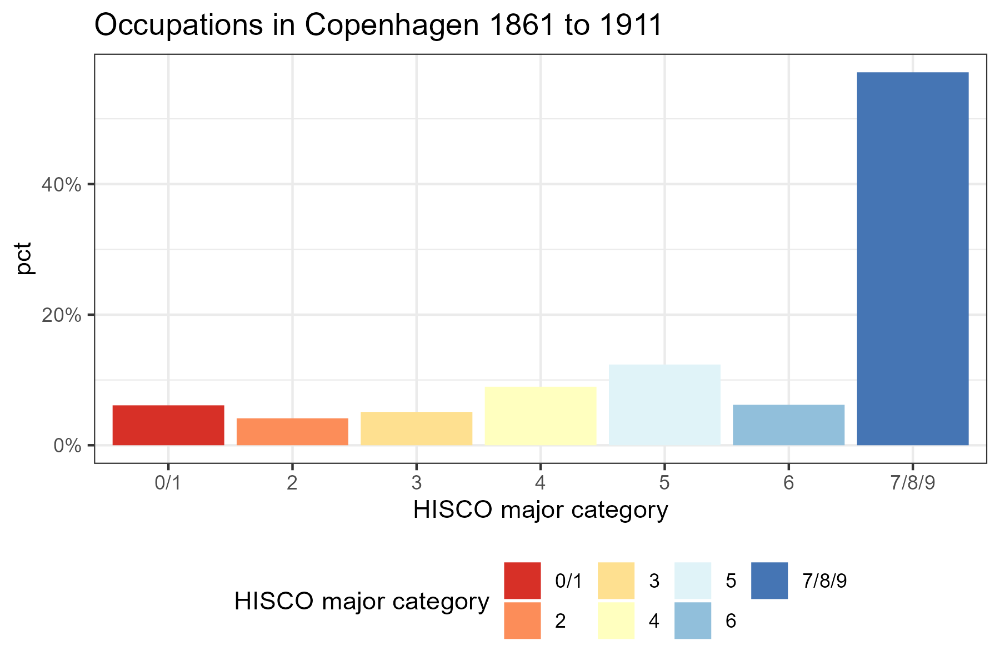

---
class: middle
# Application 2: Danish Census data (1787-1901)

.pull-left-wide[
- Danish censuses 1787-1901
- 13.5 mil. observations
- Contains a string every year describing peoples occupation

- We can turn these 13.5 million descriptions into HISCO codes in ~2 hours on a laptop with 96% accuracy
- Census data for 1787, 1801, 1845, 1880 was part of the training data of OccCANINE


#### Available:
[Vedel, Christian; Dahl, Christian Møller; Johansen, Torben S. D., 2024, "HISCO codes for Danish Census data", https://doi.org/10.7910/DVN/WZILNI, Harvard Dataverse, V3](https://doi.org/10.7910/DVN/WZILNI)

]

.pull-right-narrow[

]

---
# What were the occupational shifts?

.pull-left-narrow[
- From farming to manufacturing
]
.pull-right-wide[
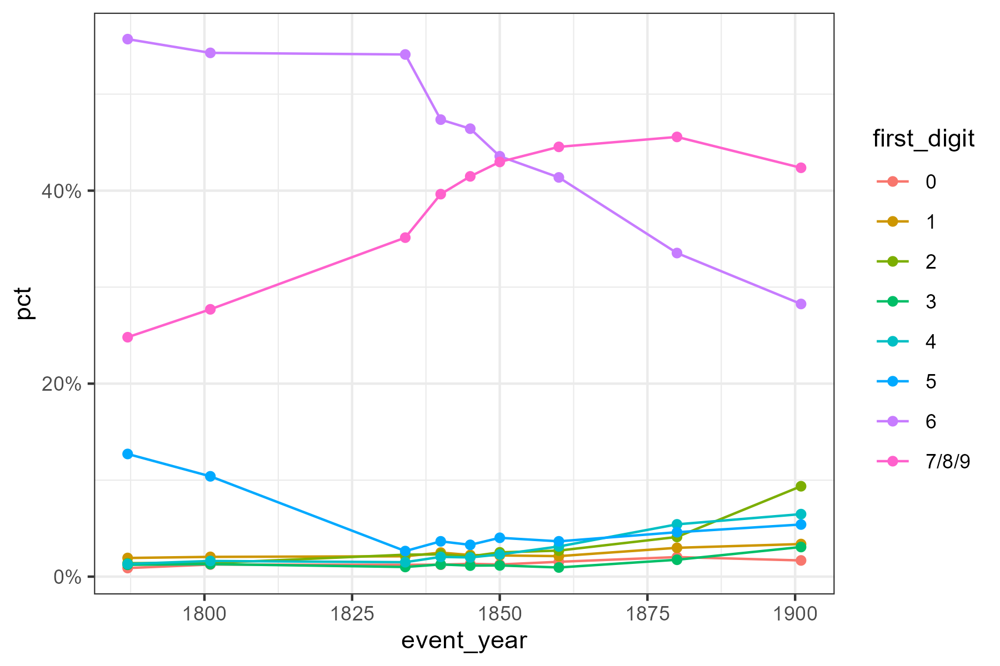
]

---
# Other applications
- Profitt et al (2025): Uses it to assist in linking British census data
- Bentzen et al (2024): Measure of social status to study assimiliation
- Jayes (2025): High skilled engineers in the age age electrification in Sweden
- Ford (2025): Early university students
- Görges et al (2025): Occupational shifts from railways in Denmark
- Chilosi et al (2025): Smithian Growth in Britain
- Andesson (2025): Labour market assimilation in historical Sweden
- Vedel (2025): First nature geography and economic development
- Fasnacth (2025): Identity and social change
- etc.

---
class: middle
# Conclusion
.pull-left[
- Something that took weeks, months and years, now takes an afternoon
- Enables new research 
- Enables more time on caring about the quality of sources and their nature
- Updated version released soon
]

.pull-right[
**Feel free to reach out**  
Twitter: @ChristianVedel  
BlueSky: @christianvedel.bsky.social  
christian-vs@sam.sdu.dk  


See guide on YouTube: https://youtu.be/BF_oNe-sABQ?si=Ef1YrkK43Ln_IHJS
]

---
class: middle, inverse, center

.huge123[**OccCANINE**]


```{r echo=FALSE, message=FALSE, warning=FALSE, out.height="150px", out.width="150px"}
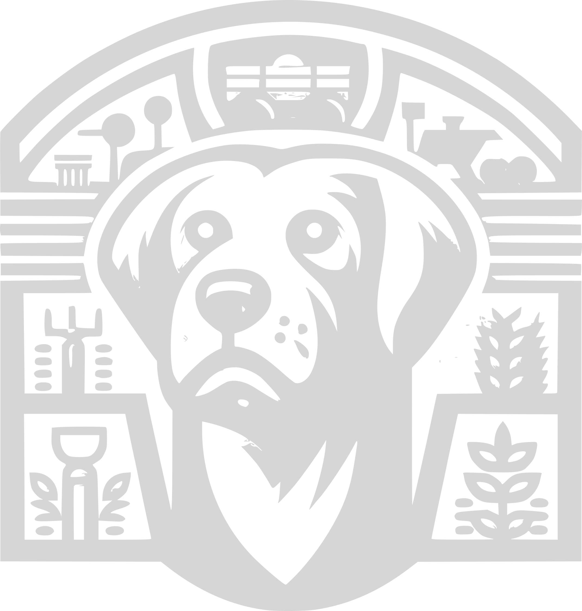
```


.footnote[
.small123[
*Logo: Matt Curtis + Bing image*
]
]

---
class: middle

# Appendix

---
name: bias-reg
# Bias regression analysis
.pull-left-narrow[
- We run regressions of the form:
$$\text{Error}_{h} = \alpha + \beta_1 \text{SES}_{h} + \epsilon_{h}$$
- Where $h$ is a HISCO code
- $\text{Error}_{h}$ is the error rate for HISCO $h$
- $\text{SES}_{h}$ is the average socio-economic status for HISCO $h$
]

.pull-right[
.small123[
|                             | Accuracy (1) | F1 score (2) | Precision (3) | Recall (4) |
|-----------------------------|-------------:|-------------:|--------------:|-----------:|
| **Panel A: SES and performance** |||||
| SES value                   |   -0.0005*   |   -0.0005*   |    -0.0005*   |  -0.0005*  |
| (SE)                        |   (0.0003)   |   (0.0003)   |    (0.0003)   |  (0.0003)  |
| **Panel B: Controlling for training obs.** |||||
| SES value                   |   -0.0004    |   -0.0004    |    -0.0004    |  -0.0004   |
| (SE)                        |   (0.0003)   |   (0.0003)   |    (0.0003)   |  (0.0003)  |
| $\log(n)$                   |    0.0045**  |    0.0046**  |     0.0044**  |   0.0049***|
| (SE)                        |   (0.0018)   |   (0.0018)   |    (0.0018)   |  (0.0018)  |
| Observations                |    1,055     |    1,055     |     1,055     |   1,055    |

*Note* $*$: p$<0.10$, $**$: p$<0.05$, $***$: p$<0.05$, 

]
]

.footnote[
[Back](#bias)
]