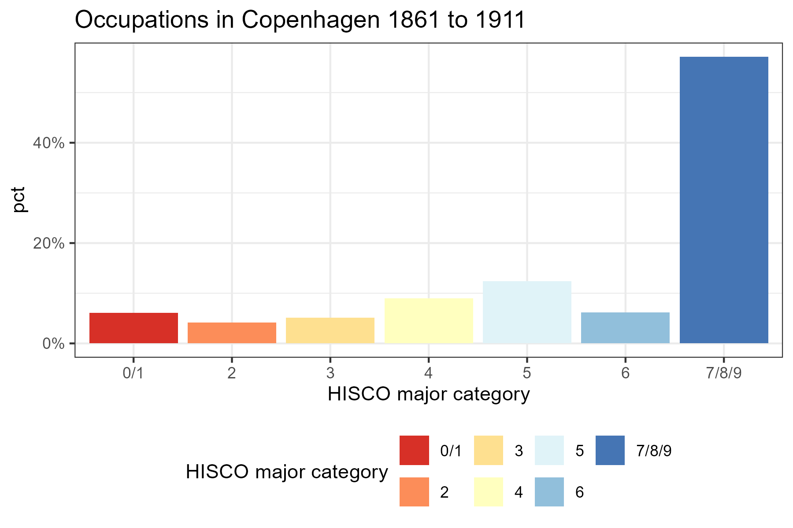

---
output:
  xaringan::moon_reader:
    includes:
      after_body: insert-logo.html
    self_contained: false
    lib_dir: libs
    nature:
      highlightStyle: github
      highlightLines: true
      countIncrementalSlides: false
      ratio: '16:9'
editor_options: 
  chunk_output_type: console
---
class: center, inverse, middle

```{r xaringan-panelset, echo=FALSE}
xaringanExtra::use_panelset()
```

```{r xaringan-tile-view, echo=FALSE}
xaringanExtra::use_tile_view()
```

```{r xaringanExtra, echo = FALSE}
xaringanExtra::use_progress_bar(color = "#808080", location = "top")
```

```{css echo=FALSE}
.pull-left {
  float: left;
  width: 48%;
}
.pull-right {
  float: right;
  width: 48%;
}
.pull-right ~ p {
  clear: both;
}

.pull-left-wide {
  float: left;
  width: 66%;
}
.pull-right-wide {
  float: right;
  width: 66%;
}
.pull-right-wide ~ p {
  clear: both;
}

.pull-left-narrow {
  float: left;
  width: 30%;
}
.pull-right-narrow {
  float: right;
  width: 30%;
}

.tiny123 {
  font-size: 0.40em;
}

.small123 {
  font-size: 0.80em;
}

.large123 {
  font-size: 2em;
}

.huge123 {
  font-size: 4em;
}

.red {
  color: red;
}

.highlight {
  background-color: yellow;
}
```


.huge123[
# Breaking the HISCO Barrier: 
## *Automatic Occupational Standardization with OccCANINE*
]

#### Christian Møller Dahl, Torben Johansen, Christian Vedel
#### University of Southern Denmark, HEDG

**Twitter: @ChristianVedel,**  
**Email: christian-vs@sam.sdu.dk**  
**arXiv: [arxiv.org/abs/2402.13604](https://arxiv.org/abs/2402.13604)**  
**Updated `r Sys.Date()`**


---
class: middle, inverse, center

.huge123[**OccCANINE**]


```{r echo=FALSE, message=FALSE, warning=FALSE, out.height="150px", out.width="150px"}

```


.footnote[
.small123[
*Logo: Matt Curtis + Bing image*
]
]

---
# Data examples
```{r echo = FALSE, message=FALSE, warning=FALSE}
library(tidyverse)
```


```{r echo=FALSE}
# load("Data_example_presentation.Rdata")
# Danish:
# tmp = readxl::read_excel("CopenhagenBurials_05_manual_check.xlsx", skip = 1)
suppressWarnings({
  tmp = read_csv("../../histocc/Data/TOYDATA.csv", col_types = "c")
})
rownames(tmp) = NULL

set.seed(20)
tmp = tmp %>%
  distinct() %>% 
  select(occ1) %>%
  filter(nchar(occ1) > 25) %>% 
  rename(`Raw entry` = occ1)

DT::datatable(
  tmp,
  fillContainer = FALSE, options = list(pageLength = 5)
)


```

.small123[
*Example data from Clark, Cummins Curtis (2022)*
]

---
# HISCO codes
- Derived from ISCO (International Standard Classification of Occupations) 
- Invented for the sake of international comparability  
- Introduced by Leuwen, Maas, Miles (2002) based on ISCO68  
- Hiearchical structure well suited for analysis

```{r echo=FALSE, message=FALSE, warning=FALSE, out.height="300px", out.width="709px"}
knitr::include_graphics("Figures/HISCO structure.png")
```


---
class: middle
# OccCANINE
.pull-left[
- New tool to make research using historical occupations easier

- 10000 observations in 27 seconds (rather than 27 hours)

- Language model, OccCANINE:
  + **Input:** "En" + "He is a farmer"
  + **Output:** HISCO code 61110 (probability=0.989589)
  
- Everything is free, open source, wrapped up in a simple python library and available at [github.com/christianvedels/OccCANINE](https://github.com/christianvedels/OccCANINE)
]

.pull-right[
<iframe width="560" height="315" src="https://www.youtube.com/embed/BF_oNe-sABQ?si=n3PxM8PkrB5esyPI" title="YouTube video player" frameborder="0" allow="accelerometer; autoplay; clipboard-write; encrypted-media; gyroscope; picture-in-picture; web-share" referrerpolicy="strict-origin-when-cross-origin" allowfullscreen></iframe>

*Youtube video on how to use it*
https://youtu.be/BF_oNe-sABQ?si=Ef1YrkK43Ln_IHJS
]

---


.pull-left[
## Open questions
- Historical developments in living standards
- The role of technology and change of technology
- The dynamics of income inequality 
- Social mobility 
- Returns to education


## Two broad barriers to research
- We need data
  + A: We need to to take data from archives
  + B: ...And turn it into something useful for analysis
]


.pull-right[
**Type A:**  
```{r echo=FALSE, message=FALSE, warning=FALSE, out.height="300px", out.width="300px"}
knitr::include_graphics("Figures/TypeA.png")
```

.red[**Type B:**]
```{r echo=FALSE, message=FALSE, warning=FALSE, out.height="300px"}

```
]

---
## Thanks to data contributors
.pull-left-wide[
.tiny123[
| file                        | Observations | Percent | Language | Source                                                    |
|-----------------------------|--------------|---------|----------|-----------------------------------------------------------|
| DK_census_[x].csv           | 5,391,656    | 29.794% | da       | Clausen (2015); The Danish National Archives              |
| EN_marr_cert_[x].csv        | 4,046,203    | 22.359% | en       | Clark, Cummins, Curtis (2022)                             |
| EN_uk_ipums_[x].csv         | 3,026,859    | 16.726% | en       | MPC (2020); Office of National Statistics                 |
| SE_swedpop_[x].csv          | 1,793,557    | 9.911%  | se       | SwedPop (2022)                                            |
| JIW_database_[x].csv        | 966,793      | 5.343%  | nl       | De Moor & van Weeren (2021)                               |
| EN_ca_ipums_[x].csv         | 818,657      | 4.524%  | unk      | MPC (2020); Statistics Canada                             |
| CA_bcn_[x].csv              | 644,484      | 3.561%  | ca       | Pujades-Mora & Valls (2017)                               |
| HISCO_website_[x].csv       | 392,248      | 2.168%  | mult     | HISCO website                                             |
| HSN_database_[x].csv        | 184,937      | 1.022%  | nl       | Mandemakers et al (2020)                                  |
| NO_ipums_[x].csv            | 147,255      | 0.814%  | no       | MPC (2020)                                                |
| FR_desc_[x].csv             | 142,778      | 0.789%  | fr       | historyofwork.iisg.nl                                     |
| EN_us_ipums_[x].csv         | 139,595      | 0.771%  | en       | MPC (2020); Bureau of the Census                          |
| EN_ship_data_[x].csv        | 103,023      | 0.569%  | en       | Schneider & Gao (2019)                                    |
| EN_parish_[x].csv           | 73,806       | 0.408%  | en       | de Pleijt, Nuvolari, Weisdorf (2020)                      |
| DK_cedar_[x].csv            | 46,563       | 0.257%  | da       | Ford (2023)                                               |
| SE_cedar_[x].csv            | 45,581       | 0.252%  | se       | Ford (2023)                                               |
| DK_orsted_[x].csv           | 36,608       | 0.202%  | da       | Ford (2023)                                               |
| EN_oclack_[x].csv           | 24,530       | 0.136%  | en       | O-clack                                                   |
| EN_loc_[x].csv              | 23,179       | 0.128%  | en       | Mooney (2016)                                             |
| IS_ipums_[x].csv            | 20,459       | 0.113%  | is       | MPC (2020)                                                |
| SE_chalmers_[x].csv         | 14,426       | 0.08%   | se       | Ford (2023)                                               |
| DE_ipums_[x].csv            | 8,482        | 0.047%  | de       | MPC (2020); Statistics Netherlands                        |
| IT_fm_[x].csv               | 4,525        | 0.025%  | it       | Fornasin & Marzona (2016)                                 |

]
]

.pull-right-narrow[
- A lot of researchers have solved the task of turning strings into HISCO codes
- We simply make their work generalizable

- We've received data from seven additional sources since the initial release
]


---
class: middle
# Our solution
.pull-left[

.center[
### OccCANINE
]
]

.pull-right[
.middle[

- We train a Neural Network for 27 days on all of the data
- Augment input during training

.red[
~10k HISCO codes in 27 seconds  
~100k HISCO codes in 5 min.  
~1 million HISCO codes in 45 min.  
$\rightarrow$ **All with high precision and recall**

]
]
]

.footnote[
Canine: Pre-training an Efficient Tokenization-Free Encoder for Language Representation (Clark et al., TACL 2022)
]

???
- Fairly simple neural network
- Transformer architecture: CANINE
- Character level: fairly robust to typos, spelling mistakes, and changing spelling conventions
- Finetuned to predict HISCO codes
- **Really fast**


--
.pull-right-narrow[
.red[**Please send us some data. We owe you HISCO codes in return**]


.red[christian-vs@sam.sdu.dk]
]

---
# How to train a generalizable solution?
.pull-left[
### Two principal solutions:
1. Learn every title character by character
2. Learn the concept of a specific occupation (like a human)

.red[
- We try to push it towards the second type of solution
]

]

.pull-right[
### How?
- Random string augmentations:
  + "he is a farmer" $\rightarrow$ "ht s a frmer"
  
- Dropout:
  + We disable 10% of neural pathways randomly during training
  
- We make synthetic combinations
  + "he is a fisher" + "carpenter" $\rightarrow$ "he is a fisher **and** carpenter"
  
- It does not know the language in 25% of cases
  
- Training data, validation data, test data and out-of-distribution data
]


---

# The product
```{r echo=TRUE, message=TRUE, warning=TRUE, eval=FALSE}
# Example prompts
model.predict("A farmer")
model.predict("Tailor of beautiful dresses")
model.predict("The train's fireman")
```

--
```{r echo=FALSE, message=TRUE, warning=TRUE}
# Example prompts
rbind(
  data.frame(
    string = "A farmer",
    hisco = "61110",
    description = "General Farmer"
  ),
  data.frame(
    string = "Tailor of beautiful dresses",
    hisco = "79100",
    description = "Tailor, Specialisation Unknown"
  ),
  data.frame(
    string = "The train's fireman",
    hisco = "98330",
    description = "Railway SteamEngine Fireman"
  )
)

```

.footnote[
***See '[PREDICT_HISCOs.py](https://github.com/christianvedels/OccCANINE/blob/main/PREDICT_HISCOs.py)' or [colab](https://github.com/christianvedels/OccCANINE/blob/main/OccCANINE_colab.ipynb)***
]


---
```{r include=FALSE, message=FALSE, warning=FALSE}
library(tidyverse)
library(plotly)

loadR1 = function(x){
  load(x)
  return(p3d)
}
loadR2 = function(x){
  load(x)
  return(p2d)
}

p3d_wlang_base = loadR1("Figures/CANINE baseline (w. lang)Interactive_tsne_3d.Rdata")
p3d_wlang = loadR1("Figures/CANINE finetuned (w. lang)Interactive_tsne_3d.Rdata")
p3d_wolang_base = loadR1("Figures/CANINE baseline (wo. lang)Interactive_tsne_3d.Rdata")
p3d_wolang = loadR1("Figures/CANINE finetuned (wo. lang)Interactive_tsne_3d.Rdata")

p2d_wlang_base = loadR2("Figures/CANINE baseline (w. lang)Interactive_tsne_2d.Rdata")
p2d_wlang = loadR2("Figures/CANINE finetuned (w. lang)Interactive_tsne_2d.Rdata")
p2d_wolang_base = loadR2("Figures/CANINE baseline (wo. lang)Interactive_tsne_2d.Rdata")
p2d_wolang = loadR2("Figures/CANINE finetuned (wo. lang)Interactive_tsne_2d.Rdata")
```

# The advantage of OccCANINE as a language model
.pull-left-narrow[
- The model learns to understand occupational structures *semantically*
- *This is evident from the the embeddings: 768 dimensions reduced to 2*
- Natural starting point for other general tasks related to occupation
 $\rightarrow$
]

.pull-right-wide[
.panelset[
.panel[.panel-name[CANINE]
.center[
```{r echo=FALSE, message=FALSE, warning=FALSE, fig.width=7, fig.height=5, fig.align='center'}
p2d_wlang_base %>% layout(autosize = F, width = 500, height = 400)
```
]
]
.panel[.panel-name[OccCANINE]
```{r echo=FALSE, message=FALSE, warning=FALSE, fig.width=7, fig.height=5}
p2d_wlang %>% layout(autosize = F, width = 500, height = 400)
```
]
]
]
---
# Test data performance (1/2)
| Statistic | Lang. info. | Value | Optimal thr. |
|-----------|-------------|-------|--------------|
| Accuracy  | No          | 0.930 | 0.46         |
| Accuracy  | Yes         | 0.935 | 0.45         |
| F1 score  | No          | 0.956 | 0.20         |
| F1 score  | Yes         | 0.960 | 0.22         |
| Precision | No          | 0.951 | 0.37         |
| Precision | Yes         | 0.955 | 0.40         |
| Recall    | No          | 0.986 | 0.01         |
| Recall    | Yes         | 0.987 | 0.01         |

.footnote[
.small123[
*Based on 1 million test observations*
]
]

---
# Test data performance (2/2) 
```{r echo=FALSE, message=FALSE, warning=FALSE, out.height="450px", out.width="675px"}
knitr::include_graphics("Figures/Performance_by_language.png")
```

---
# The nature of the mistakes
.panelset[
.panel[.panel-name[Example 1]
.center[
```{r echo=FALSE, message=FALSE, warning=FALSE, out.height="450px", out.width="675px"}
knitr::include_graphics("Figures/CANINE_preds_w_lang/RowID_EN_marr_cert3742836.png")
```
]
]
.panel[.panel-name[Example 2]
.center[
```{r echo=FALSE, message=FALSE, warning=FALSE, out.height="450px", out.width="675px"}
knitr::include_graphics("Figures/CANINE_preds_w_lang/RowID_EN_parish33715.png")
```
]
]
.panel[.panel-name[Example 3]
.center[
```{r echo=FALSE, message=FALSE, warning=FALSE, out.height="450px", out.width="675px"}
knitr::include_graphics("Figures/CANINE_preds_w_lang/RowID_EN_uk_ipums2325523.png")
```
]
]
.panel[.panel-name[Example 4]
.center[
```{r echo=FALSE, message=FALSE, warning=FALSE, out.height="450px", out.width="675px"}
knitr::include_graphics("Figures/CANINE_preds_w_lang/RowID_DK_census1787182508.png")
```
]
]
]

---
# Out of distribution

| Dataset                   | N checked | Accuracy | Exact agreement | Subst. agreement |
|---------------------------|-----------|----------|-----------------|------------------|
| Copenhagen Burial Records | 200       | 0.950    | -               | -                |
| Training Ship Data        | 200       | 0.985    | 0.820           | 0.965            |
| Swedish Strikes           | 200       | 0.945    | 0.805           | 0.935            |
| Dutch Familiegeld         | 200       | 0.925    | 0.670           | 0.925            |


.footnote[
.small123[
$^*$ *Thanks to Bram Hilkens*  
See more details in the paper
]
]


---
# Differential error rates
.pull-left-narrow[
- Performs best for the most common HISCO codes (99% --> 524 HISCO codes)
- (As does squishy wet neural networks)
]

.pull-right-wide[

]

---
# Bias

.pull-left-narrow[
- Potential problem: If error rates are correlated with Socio-Economic Status
- Turns out its not
- Not in a regression setting either
]

.pull-right-wide[

]


---
# Architecture


**Summary:** Description goes in, probabilities comes out


---
# Application 1: Copenhagen Burial Records 
*Data from CPH burial records - 95% accuracy*

*388,057 Copenhageners from around ~1861 to ~1911*

```{r echo=FALSE, message=FALSE, warning=FALSE, cache=TRUE}
data0 = read_csv2("CPH_hisco_codes_clean.csv")

data0 = data0 %>% 
  pivot_longer(
    cols = hisco1:hisco5
  ) %>% 
  distinct(pa_id, occ1, name, value) %>% 
  drop_na(value) %>% 
  mutate(
    value = as.character(value)
  ) %>% 
  mutate( # Fix leading zeros
    value = ifelse(nchar(value)==4, paste("0", value), value)
  ) %>% 
  mutate(
    HISCO1st = substr(value, 1, 1)
  ) %>% 
  select(-name) %>% 
  rename(hisco = value)

```

.small123[
```{r echo=FALSE, message=FALSE, warning=FALSE, cache=TRUE}
set.seed(20)
tmp = data0 %>% 
  distinct(occ1, hisco, HISCO1st) %>% 
  sample_frac() %>% 
  rename(
    Occupation = occ1,
    `1 st digit`= HISCO1st
  )
tmp = tmp[1:100,]

DT::datatable(
  tmp,
  fillContainer = FALSE, options = list(pageLength = 4)
)
```

]

.footnote[
Data from Link Lives. See https://link-lives.dk/
]

---
# Application 1: Copenhagen Burial Records
```{r echo=FALSE, message=FALSE, warning=FALSE, cache=TRUE}
p1 = data0 %>% 
  mutate(
    HISCO1st = ifelse(
      HISCO1st %in% c("0", "1"), "0/1", HISCO1st
    )
  ) %>% 
  mutate(
    HISCO1st = ifelse(
      HISCO1st %in% c("7", "8", "9"), "7/8/9", HISCO1st
    )
  ) %>% 
  group_by(HISCO1st) %>% 
  count() %>% 
  ungroup() %>% 
  mutate(
    pct = n/sum(n)
  ) %>% 
  ggplot(aes(HISCO1st, y = pct, fill = HISCO1st)) + 
  geom_bar(stat = "identity") + 
  scale_fill_brewer(palette = "RdYlBu") + 
  labs(fill = "HISCO major category", x = "HISCO major category") + 
  theme_bw() +
  theme(legend.position = "bottom") +
  scale_y_continuous(labels = scales::percent) +
  labs(
    title = "Occupations in Copenhagen 1861 to 1911"
  )

ggsave("Figures/CPH_stats.png", plot = p1, width = 6, height = 4)
```



---
class: middle
# Application 2: Danish Census data (1787-1901)

.pull-left-wide[
- Danish censuses 1787-1901
- 13.5 mil. observations
- Contains a string every year describing peoples occupation

- We can turn these 13.5 million descriptions into HISCO codes in ~2 hours on a laptop with 96% accuracy
- Census data for 1787, 1801, 1845, 1880 was part of the training data of OccCANINE


#### Available:
[Vedel, Christian; Dahl, Christian Møller; Johansen, Torben S. D., 2024, "HISCO codes for Danish Census data", https://doi.org/10.7910/DVN/WZILNI, Harvard Dataverse, V3](https://doi.org/10.7910/DVN/WZILNI)

]

.pull-right-narrow[

]

---
# What were the occupational shifts?

.pull-left-narrow[
- From farming to manufacturing
]
.pull-right-wide[

]

---
# Application 2: Danish Census data (1787-1901)

.pull-left[
- We can proxy for income by looking at the average income of each occupation.
- For now based on 1915 average incomes
- Extensions possble


**How do we turn 1915 incomes into HISCO-code-level incomes?** $\rightarrow$ ***Also use OccCANINE***

$$
\mathbb{E}(w_i|h_j)=\sum_i^N w_i \frac{\overset{OccCANINE}{\overbrace{Pr(h_j|w_i)}}\overset{Prior}{\overbrace{Pr(w_i)}}}{\underset{Normalization / Evidence}{\underbrace{Pr(h_j)}}}
$$
]

.pull-right[

]

---
# Danish Economic History in three bullets
.pull-left[
- When was the economic take-off in Denmark?
- Latter half of 19th century (Henriksen, 2006)
- Wages: From among the poorest to being among the richest in the period 1850-1900 (Khaustova, Sharp, 2015)
- **But how much of this is driven by occupational shifts?**
  + *Answer*: Some of it was
]

.pull-right-narrow[

*I've heard the creameries also played a role (Lampe & Sharp, 2019)*
]


---
# Application 2: Danish Census data (1787-1901)

.pull-left-wide[

]

.pull-right-narrow[
- Stable (occupational) incomes until mid 1800s
- Sharp shift upwards
- People started taking jobs that (eventually) would pay more 

]

---
# What we are working on

.pull-left[
### Three main chalenges for the current model
1. Weaker performance in some languages
2. Predicts full code rather than digits
3. Rare cases of weird predictions in otherwise obvious cases $^1$
4. Slow finetuning into other systems than HISCO

.footnote[
.small123[
$^1$: We always reccomend checking 200 observations manually. This is still much quicker than having to find HISCO codes for 20000 observations manually. 
]
]

]

.pull-right[
### Development
- New training data
- Digit-based seq2seq architecture (predict one digit at a time)
- More string augmentation:
  + Adversarial training examples: Changing descriptions only slightly to make the model make wrong guesses
  + Double translation 
  + Random strings should always be '-1'
- Testing 'finetunability' to OCC1950, OCCICEM, PSTI, ISCO68 
- Two user end options: *'fast'* or *'advanced'*
]

---
class: middle
# Demonstration
- Everything is open source.
- You can use our method with basic Python-skills
- Most functionalities demonstrated here: [colab](https://github.com/christianvedels/OccCANINE/blob/main/OccCANINE_colab.ipynb)

---
class: middle
# Conclusion
.pull-left[
- Something that took weeks, months and years, now takes an afternoon
- Enables new research 
- Enables more time on caring about the quality of sources and their nature

- We will further train ***OccCANINE*** during the summer $\rightarrow$ *please share data*

]

.pull-right[
**Feel free to reach out**  
Twitter: @ChristianVedel  
christian-vs@sam.sdu.dk  


See guide on YouTube: https://youtu.be/BF_oNe-sABQ?si=Ef1YrkK43Ln_IHJS
]


