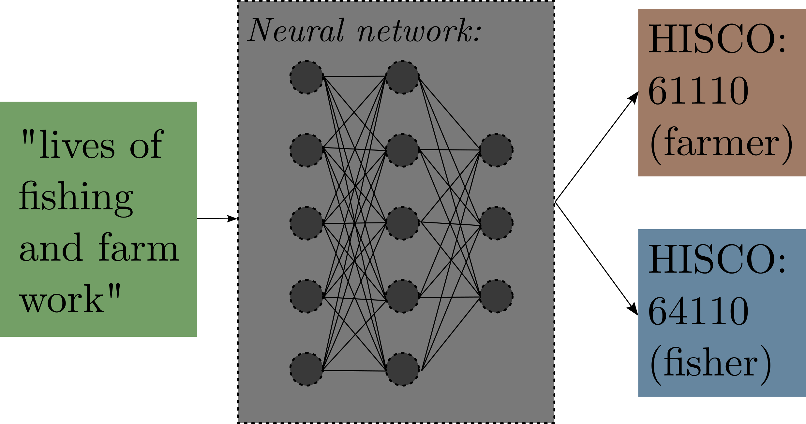

---
output:
  xaringan::moon_reader:
    includes:
      after_body: insert-logo.html
    self_contained: false
    lib_dir: libs
    nature:
      highlightStyle: github
      highlightLines: true
      countIncrementalSlides: false
      ratio: '16:9'
editor_options: 
  chunk_output_type: console
---
class: middle, inverse, center

```{r xaringan-panelset, echo=FALSE}
xaringanExtra::use_panelset()
```

```{r xaringan-tile-view, echo=FALSE}
xaringanExtra::use_tile_view()
```

```{r xaringanExtra, echo = FALSE}
xaringanExtra::use_progress_bar(color = "#808080", location = "top")
```

```{css echo=FALSE}
.pull-left {
  float: left;
  width: 48%;
}
.pull-right {
  float: right;
  width: 48%;
}
.pull-right ~ p {
  clear: both;
}

.pull-left-wide {
  float: left;
  width: 66%;
}
.pull-right-wide {
  float: right;
  width: 66%;
}
.pull-right-wide ~ p {
  clear: both;
}

.pull-left-narrow {
  float: left;
  width: 30%;
}
.pull-right-narrow {
  float: right;
  width: 30%;
}

.tiny123 {
  font-size: 0.40em;
}

.small123 {
  font-size: 0.80em;
}

.large123 {
  font-size: 2em;
}

.huge123 {
  font-size: 6em;
}

.red {
  color: red;
}

.highlight {
  background-color: yellow;
}
```


.huge123[**OccCANINE**]

???
In this video we are introducing OccCANINE and how to use it.

---
class: middle

.pull-left[
# OccCANINE
- New tool to make research using historical occupations easier
- Language model, OccCANINE:
  + **Input:** "En" + "He is a farmer"
  + **Output:** HISCO code 61110 (probability=0.989589)
  
- Everything is free, open source, wrapped up in a simple python library and available at [github.com/christianvedels/OccCANINE](https://github.com/christianvedels/OccCANINE)

]

???
OccCANINE is a new tool to make research with historical occupations easier

It's based on a language model CANINE, 

which we finetuned for the purpose with 14 mio. examples of HISCO codes 

in 13 different languages

**The result:**

A transformer-based language model (like chatGPT, but much smaller) 

Which takes a language and an occupational description:

"English" + "He is a farmer" 

And 

Outputs a probability


---
class: middle
# Plan

1. Introduction to OccCANINE and its performance
2. How to use OccCANINE

???
Here's the plan

- We will briefly go over OccCANINE and its performance
- Then we will introduce how to use it
- Command line interface

---
# Team

.pull-left[
```{r echo=FALSE, message=FALSE, warning=FALSE, out.width=150}
knitr::include_graphics("https://portal.findresearcher.sdu.dk/files-asset/200947586/1b5a4dd1-bfba-4b37-a685-854958b1dd4e.jpg?w=160&f=webp")
```

.small123[Christian Møller Dahl, Professor]


```{r echo=FALSE, message=FALSE, warning=FALSE, out.width=150}
knitr::include_graphics("https://portal.findresearcher.sdu.dk/files-asset/234467387/4353be14-7b5e-4a74-949c-144e6478a7da.jpg?w=160&f=webp")
```

.small123[Christian Vedel, Assistant Professor]

]

.pull-right[
```{r echo=FALSE, message=FALSE, warning=FALSE, out.width=150}
knitr::include_graphics("https://media.licdn.com/dms/image/C4D03AQHyT9bJKlGKiA/profile-displayphoto-shrink_800_800/0/1581022934019?e=1716422400&v=beta&t=M00riaQqwb3DTRb_KD80_B1-POZINjpYq2VexqQ_kpE")
```

.small123[Torben S. D. Johansen, Assistant Professor]
]

.center[
*All at the University of Southern Denmark (SDU), Department of Economics*
]

???
This is the team behind this tool
All of us researchers at the department of Economics, at the university of Southern Denmark

---
# Data - thanks to...
.pull-left[
.tiny123[
| Shorthand name   | Language | Source                                                    |
|------------------|----------|-----------------------------------------------------------|
| DK_census        | da       | Clausen (2015); The Danish National Archives              |
| EN_marr_cert     | en       | Clark, Cummins, Curtis (2022)                                    |
| EN_uk_ipums      | en       | MPS (2020); Office of National Statistics                 |
| SE_swedpop       | se       | SwedPop Team (2022)                                       |
| JIW_database     | nl       | Moor and van Weeren (“2021”)                              |
| EN_ca_ipums      | unk      | MPS (2020); Statistics Canada                             |
| CA_bcn           | ca       | Pujades Mora and Valls (2017)                             |
| HISCO_website    | mult     | HISCO database (2023)                                     |
| HSN_database     | nl       | Mandemakers et al (2020)                                  |
| NO_ipums         | no       | MPS (2020)                                                |
| FR_desc          | fr       | HISCO database (2023)                                     |
| EN_us_ipums      | en       | MPS (2020); Bureau of the Census                          |
| EN_parish        | en       | de Pleijt Nuvolari and Weisdorf (2019)                    |
| DK_cedar         | da       | Ford (2023)                                               |
| SE_cedar         | se       | Edvinsson and Westberg (2016)                             |
| DK_orsted        | da       | Ford (2023)                                               |
| EN_oclack        | en       | Zijdeman (2023)                                           |
| EN_loc           | en       | Mooney (2016)                                             |
| IS_ipums         | is       | MPS (2020)                                                |
| SE_chalmers      | se       | Ford (2023)                                               |
| DE_ipums         | ge       | MPS (2020); German Federal Statistical Office             |
| IT_fm            | it       | Fornasin and Marzona (2016)                               |

]
]

???
OccCANINE is trained on 14 mio examples of occupational descriptions,

which is paired with HISCO codes 

We get this from all of these projects, which were available or shared with us.

For this we are immensely grateful

---
# Data examples


.pull-left[
```{r echo = FALSE, message=FALSE, warning=FALSE}
library(tidyverse)
```

```{r echo=FALSE}
load("Data_example_presentation.Rdata")
rownames(tmp) = NULL

tmp = tmp %>% 
  select(occ1) %>% 
  filter(nchar(occ1) > 15) %>% 
  rename(`Raw entry` = occ1)

DT::datatable(
  tmp,
  fillContainer = FALSE, options = list(pageLength = 5)
)
```

*Data from Clark, Cummins, Curtis (2022)*
]


.pull-right[
.large123[
**Challenge:** We want to systematize this data
]
]

???
- There is a lot of data out there, which describes peoples occupation
- Here data from Mariage certificates in England
- If we systematise this type of information, we can gain new insights into countless new research avenues.

---
class: middle
.pull-left[
# The old solution
- Spend weeks, months or years manually reading and categorizing 

- 17865 different occupational descriptions fit with "farm servant" in DK censuses ("in service", "servant girl", "servant boy", "servant woman", "servant karl") 

- Spelling mistakes, negations, and different spelling conventions
]

???
- Does not work well
- Takes time
- Does not scale

---
class: middle
# Our solution
.pull-left[

.center[
### OccCANINE
]
]

.pull-right[
.middle[
.red[
~10k HISCO codes in 27 seconds  
~100k HISCO codes in 5 min.  
~1 million HISCO codes in 45 min.  
$\rightarrow$ **All with high precision and recall**

]
]
]

.footnote[
Canine: Pre-training an Efficient Tokenization-Free Encoder for Language Representation (Clark et al., TACL 2022)
]

???
- Fairly simple neural network
- Transformer architecture: CANINE
- Character level: fairly robust to typos, spelling mistakes, and changing spelling conventions
- Finetuned to predict HISCO codes
- **Really fast**

---
class: middle
# Test data performance
.pull-left-narrow[
| Statistic | Lang. info. | Value |
|-----------|-------------|-------|
| Accuracy  | Yes         | 0.935 |
| F1 score  | Yes         | 0.960 |
| Precision | Yes         | 0.955 |
| Recall    | Yes         | 0.987 |
]

.footnote[
.small123[
*Based on 1 million test observations*
]
]

???
No matter how we measure, the tool works well

The accuracy is above 93% 

The Precision and Recall is also in the high 90s

F1 is a mix of the two

---
class: middle
# Multilingual performance
.pull-left[
```{r echo=FALSE, message=FALSE, warning=FALSE, out.width=900}
knitr::include_graphics("Figures/F1_multiling.png")
```
]

???
Performs well across all languages

---
class: middle

# Out of Distribution
.pull-left[
| Dataset                    | N checked | Accuracy |
|----------------------------|-----------|----------|
| Copenhagen Burial Records  | 200       | 0.950    |
| Training Ship Data         | 200       | 0.985    |
| Swedish Strikes            | 200       | 0.945    |
| Dutch Familiegeld*         | 200       | 0.925    |

.footnote[
.small123[
$^*$ *Thanks to Bram Hilkens*  
See more details in the paper
]
]

]

???
These data sources are entirely new. Not used in training. 

---
class: middle

# Read more in
.pull-left[
Dahl, C. M., Johansen, T. S. D., Vedel, C. (2024). Breaking the HISCO barrier: Automatic occupational standardization with OccCANINE. [arxiv.org/abs/2402.13604](https://arxiv.org/abs/2402.13604)
]

.pull-right[

]


???
Onwards to how to use it


